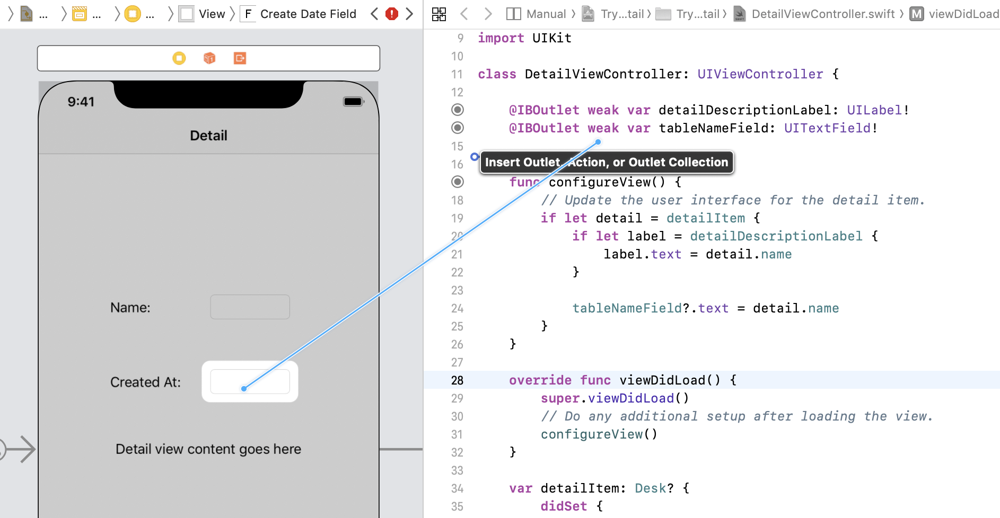

:source-highlighter: rouge
:source-language: swift
:imagesdir: ./

= Leitfaden ARKit-Training (Training 2)

== Aufgabe 1: Projekt anlegen & Action ausführen

. Erstelle in Xcode ein neues Swift-Projekt mit dem Namen “iOSRestaurantTableFinder".
Nutze das _ARKit_-Template. Das generierte Projekt enthält die komplette nötige Projekt-Struktur inklusive Storyboard. Mache dich mit der Struktur des Projekts und den einzelnen Dateien vertraut.

. Öffne `Main.storyboard` und ziehe einen Button von der Library auf den `ViewController`. Ändere die Beschriftung des Buttons auf "Add Object" durch Doppelklick auf den Button.
+
TIP: Die Library lässt sich mit dem Befehl `cmd+shift+L` öffnen.
+
NOTE: Eventuell muss für die Platzierung des Buttons das Gerät im Storyboard auf das Gerät geändert werden, das zur Verfügung steht. Klicke dazu auf `View as: iPhone X`, und öffne darunter das entsprechende Gerät durch Klicken.

//TODO: Besseres Bild, genauere Beschreibung hier hinzufügen.
. Erstelle im DetailsViewController per Drag and Drop aus dem Storyboard eine `Action` für den Button.
+
TIP: Öffne den Assistant-Editor (oben links, das Symbol mit zwei Kreisen). Im linken Fenster sollte sich das Storyboard befinden. Wenn du im Storyboard den ViewController auswählst, sollte sich im rechten Fenster die `ViewController.swift`-Datei öffnen. Drücke dann CTRL, und ziehe vom Button auf den ViewController. Wähle `Action` im sich öffnenden Menü. Benenne anschließend die Action wie gewünscht.
+
[source]
----
@IBAction func addButtonPressed(_ sender: Any){
    // This is what is executed when tapping on the button.
}
----
+

. In der `addButtonPressed`- Methode in `ViewController.swift`, füge `print("Hello, World!")` hinzu. Starte die App, drücke den Button, und prüfe, ob im Terminal von Xcode "Hello, World!" erscheint.

== Aufgabe 2: Nodes zur Szene hinzufügen.

. Wir wollten mit dem Button ein 3D-Objekt zur Szene hinzufügen. Dafür müssen wir einen `SCNNode` erstellen, und ihn in den _Scenegraph_ der `SceneView` einbinden. Ergänze dafür folgende Zeilen in der `addButtonPressed`-Methode:
+
[source]
----
@IBAction func addButtonPressed(_ sender: Any){
    // Create an empty node.
    let node = SCNNode() 

    // Attach it to the root of our scene.
    sceneView.scene.rootNode.addChildNode(node)
}
----

. Wenn die App jetzt gestartet wird, verändert sich _nichts sichtbares_ in der Szene - es wurde zwar ein Node hinzugefügt, aber dieser enthält kein 3D-Objekt und wird nicht visuell dargestellt. Um ein Objekt (eine Geometrie) zu erstellen, muss ein `SCNGeometry`-Object erstellt und dem Node beim erstellen als Parameter mitgegeben werden. Ändere die `addButtonPressed`-Methode folgenderweise ab:
+
[source]
----
@IBAction func addButtonPressed(_ sender: Any){
    // Create a box geometry.
    let boxGeometry = SCNBox(width: 0.25, height: 0.25, length: 0.25, chamferRadius: 0.01)

    // Create the node using this geometry.
    let node = SCNNode(geometry: boxGeometry) 

    sceneView.scene.rootNode.addChildNode(node)
}
----

. Starte die App, warte kurz, bis das ARKit-Tracking greift, und bewege dann das iPhone Richtung Bildschirm. Es sollte sich nun eine kleine virtuelle Box dort befinden, wo das iPhone das Tracking begonnen hat. Um die Box von Beginn an im sichtbaren Bereich zu platzieren, können wir sie mit dem `position`- Attribut am Node verschieben:
+
[source]
----
@IBAction func addButtonPressed(_ sender: Any){
    let boxGeometry = SCNBox(width: 0.25, height: 0.25, length: 0.25, chamferRadius: 0.01)
    let node = SCNNode(geometry: boxGeometry) 

    // Move the node 1.5m forward.
    node.position = SCNVector3(0, 0, -1.5)

    sceneView.scene.rootNode.addChildNode(node)
}
----
+
NOTE: In ARKit zeigt `x` nach rechts, `y` nach oben, und `z` nach hinten. Wenn wir den Node also in negative z-Richtung bewegen, erscheint vor dem Ursprung (d.h., vor der ursprünglichen Position des iPhone.) 

. Wir wollen nun die Box an eine beliebige Stelle im Raum platzieren. Dafür soll erst der Node so platziert werden, dass er sich mit der Kamera (/mit dem iPhone) bewegt. Das können wir erreichen, indem wir den Node nicht an den `rootNode` der Scene hängen, sondern an die virtuelle Kamera. Ändere die letzte Zeile der `addButtonPressed` auf
+
[source]
----
sceneView.pointOfView!.addChildNode(node)
----
+
NOTE: Wird die App jetzt gestartet, wird die Box immer relativ zur Kamera platziert. Mit dem `position`-Attribut kontrollieren wir jetzt die Position relativ zur Kamera.

. Durch Bewegen des Geräts können wir jetzt die Box beliebig im Raum bewegen. Als nächster Schritt soll nun die Box auf einen Button-Click von der Kamera gelöst werden und an der Stelle im Raum festgesetzt werden.

.. Füge einen neuen Button hinzu, wie in Aufgabe 1 beschrieben. Der Button soll mit "Place Item" beschriftet sein und auf eine `placeItemButtonPressed`-Methode verweisen.
.. In der `addButtonPressed`-Methode, speichere den zuletzt hinzugefügten Knoten in einem neuen Attribut `heldObjectNode: SCNNode?`.
+
[source]
----
var heldObjectNode: SCNNode?
----
+
[source]
----
heldObjectNode = node
----
.. In der `placeItemButtonPressed`-Methode, entferne den `heldObjectNode` von der Kamera und füge ihn wieder an den `rootNode` der Szene hinzu.
+
[source]
----
if heldObjectNode != nil {
    heldObjectNode?.removeFromParentNode()
    sceneView.scene.rootNode.addChildNode(heldObjectNode!)
}
----
.. Da die `position` des `heldObjectNode` immer relativ zum aktuellen `parentNode` ist, und wir sie nicht explizit ändern, wird der Node nach dem Platzieren wieder auf die Ursprungsposition zurückgesetzt. Um dies zu vermeiden, können wir die aktuelle `worldTransform` (d.h., die aktuelle Position und Rotation zum Ursprung) speichern und als `transform` relativ zum `rootNode` verwenden. Nun sollte die Box nach dem Platzieren an ihrer ursprünglichen Position sitzen.
+
[source]
----
if heldObjectNode != nil {
    let transform = heldObjectNode!.worldTransform
    heldObjectNode?.removeFromParentNode()
    sceneView.scene.rootNode.addChildNode(heldObjectNode!)
    heldObjectNode!.transform = transform
}
----

== Aufgabe 3: Nodes aufnehmen und bewegen

. Wir wollen nun Nodes wieder aufnehmen und bewegen können. Als ersten Schritt sollen die Elemente markiert werden, die gerade im Zentrum des Bildschirms angezeigt werden. Um dies zu erreichen müssen wir die `renderer(_ renderer: SCNSceneRenderer, updateAtTime time: TimeInterval)` überschreiben.
+
[source]
----
func renderer(_ renderer: SCNSceneRenderer, updateAtTime time: TimeInterval) {
    ...
}
----

. Erstelle 

== Aufgabe 4: Steuern eines Raumschiffs

. TODO: Neuen AR-ViewController hinzufügen.

=== Aufgabe 4.1 Joystick-Control
Ziel: Wir wollen eine eigene Joystick-Control-View erstellen, mit der wir später ein virtuelles Raumschiff steuern können.

. Erstelle über File > New File ... > Cocoa Touch Class eine neue _UIControl_-Subklasse in Swift mit dem Namen "JoystickControl". 

. Füge die neue Control zu dem gerade erstellten DroneViewController hinzu. Platziere sie in die Mitte des Bildschirms.

. Wir werden `CAShapeLayer` nutzen, um die Darstellung der View schnell und effektiv zu rendern. Dafür müssen wir bei Erstellung der View die Layer (die Shapes) definieren, die angezeigt werden sollen. Überschreibe dafür die beiden Konstruktoren für UIViews wie beschrieben und rufe bei beiden die `setup`-Methode auf.
+
[source]
----
override init(frame: CGRect) {
    super.init(frame: frame)
    setup()
}

required init?(coder aDecoder: NSCoder) {
    super.init(coder: aDecoder)
    setup()
}

private func setup(){

}
----
+
TODO: In der Implementierung hängt outlineShape als Attribut am Viewcontroller, damit bei Änderung der Größe der View (ie, layoutSubViews) die Größe angepasst wird. Wenn AutoLayout nicht verwendet wird, sollte das kein Problem sein; evtl. muss man statt "bounds" ein festes CGRect nehmen. (Oder eben einfach die Implementierung in der App beschreiben).

. Erstelle ein neues `CAShapeLayer` für die Outline des Joysticks.
+
[source]
let outlineShape = CAShapeLayer()

.. Erstelle einen Pfad für das Layer, der einen Kreis innerhalb der `bounds` der UIControl beschreibt.
+
[source]
----
outlineShape!.path = CGPath(ellipseIn: bounds, transform: nil)
---- 

.. Setze `strokeColor`, `lineWidth`, `opacity` und `fillColor`, um die Darstellung der Form zu beeinflussen.
+
[source]
----
outlineShape!.strokeColor = UIColor.green.cgColor
outlineShape!.lineWidth = 2.0
outlineShape!.opacity = 1.0
outlineShape!.fillColor = UIColor.green.withAlphaComponent(0.25).cgColor
----

.. Füge das Layer als neues Sublayer zu der View hinzu, damit es angezeigt wird.
+
[source]
----
self.layer.addSublayer(outlineShape!)
----
+
NOTE: Die View sollte jetzt als grüner, halbtransparenter Kreis mit Border angezeigt werden. Eventuell muss noch im Storyboard das `opaque`-Attribut am /View/ deaktiviert werden, damit die View als durchsichtig gerendert wird.

. Zusätzlich zur Outline soll es eine zweite Shape geben, die den aktuellen Zustand (also die Auslenkung) des Joysticks beschreibt. Füge dazu ein neues Attribut zum DroneViewController hinzu, und initialisiere es in `setup`.
+
[source]
----
// Add to class
var stickShape: CAShapeLayer!
----
+
[source]
----
// Add to setup
stickShape = CAShapeLayer()
stickShape!.fillColor = UIColor.green.cgColor
let stickSize: CGFloat = 48
let stickRect = CGRect(x: -stickSize / 2, y: -stickSize / 2, width: stickSize, height: stickSize)
stickShape!.path = CGPath(ellipseIn: stickRect, transform: nil)
stickShape.shadowPath = stickShape.path
self.layer.addSublayer(stickShape)
----

. Der Joystick wird jetzt angezeigt, reagiert aber noch nicht auf Touch-Inputs. Um auf Berührungen zu reagieren, müssen drei Methoden implementiert werden:
- `touchesBegan`: Wird aufgerufen, sobald die View berührt wird.
- `touchesMoved`: Wird aufgerufen, wenn sie sich der Finger bewegt.
- `touchesEnded`: Wird aufgerufen, wenn die Berührung endet.

.. In `touchesBegan` soll die innere Shape (die `stickShape`) auf die Position der Berührung verschoben werden.
+
[source]
----
override func touchesBegan(_ touches: Set<UITouch>, with event: UIEvent?) {
    stickShape.position = touches.first!.location(in: self)
    self.sendActions(for: .valueChanged)
}
----

.. In `touchesMoved` wird ebenfalls die `stickShape` auf die Fingerposition bewegt. 
+
[source]
----
override func touchesMoved(_ touches: Set<UITouch>, with event: UIEvent?) {
    // Disable actions to remove the default 0.1s animation for moving the layer.
    CATransaction.begin()
    CATransaction.setDisableActions(true)
    stickShape.position = touches.first!.location(in: self)
    CATransaction.commit()
    self.sendActions(for: .valueChanged)
}
----
+
NOTE: Wenn das `position`-Attribut an dem Layer verändert wird animiert iOS als Standard die Bewegung über 0.1s. Die `CATransaction`-Calls hier dienen dazu, diese Animation zu deaktivieren.

.. In `touchesEnded` wird die Position der `stickShape` zurückgesetzt.
+
[source]
----
override func touchesEnded(_ touches: Set<UITouch>, with event: UIEvent?) {
    // This is implicitly animated.
    self.stickShape.position = self.bounds.center
}
----

. Als letztes soll die Control einen Wert zur Verfügung stellen, der die Auslenkung des Joysticks beschreibt und von dem ViewController genutzt werden kann, um die Drone zu steuern. Wir implementieren das als _computed property_ und berechnen es einfach aus der Position der `stickShape`.
+
[source]
----
var value: (Float, Float) {
    get {
        let scale = self.bounds.width / 2
        var x = Float((stickShape.position.x - self.bounds.center.x) / scale)
        var y = Float((stickShape.position.y - self.bounds.center.y) / scale)
        return (x, y)
    }
}
----
// NOTE: Die Referenzimplementierung ist ein bisschen komplizierter und hat eine deadZone, innerhalb der der Wert auf 0 bleibt. Außerdem verhindert wird dort der Betrag des Werts auf 1 beschränkt.

- In den Touch-Handling-Methoden sollen nun Actions gesendet werden, mit denen man die Änderung des Values der View verfolgen kann. Füge dazu `self.sendActions(for: .valueChanged)` zu allen dieser Methoden hinzu.

== Aufgabe 4.2 DroneViewController

. Als nächstes soll die Steuerung des Raumschiffs mit den Joysticks implementiert werden. Füge als erstes eine zweite `JoystickControl` zum `DroneViewController` hinzu, und erstelle `IBOutlets` für beide Controls (z.B. `joystickRight` und `joystickLeft`).

. Wir benötigen eine Referenz auf den `SCNNode`, der das Raumschiff enthält. Ergänze hierfür folgende Methode am `DroneViewController` und rufe sie nach dem Laden der Scene in `viewDidLoad` auf.
+
[source]
----
func findAndAdjustShip(){
    shipNode = sceneView.scene.rootNode.childNode(withName: "ship", recursively: false)

    shipNode.position = SCNVector3(0, 0, -1)
    shipNode.childNodes.first!.eulerAngles.y = .pi
    shipNode.childNodes.first!.scale = SCNVector3(0.01, 0.01, 0.01)
}
----

. Damit SceneKit die Kräfte, die auf das Raumschiff einwirken, korrekt berechnen kann, muss ein `SCNPhysicsBody` für das Raumschiff definiert werden. Ergänze folgende Zeilen in der `findAndAdjustShip`:
+
[source]
----
// Erstellt einen PhysicsBody, der die Form einer Kugel hat
shipNode.physicsBody = SCNPhysicsBody(type: .dynamic, shape: SCNPhysicsShape(geometry: SCNSphere(radius: 0.5), options: nil))
// damping beeinflusst, wie stark Bewegungen gedämpft werden (ähnlich einem Luft- oder Wasserwiderstand)
shipNode.physicsBody?.damping = 0.8
// angularDamping ist das Äquivalent für Rotationen
shipNode.physicsBody?.angularDamping = 0.8
----
+
NOTE: Wir setzen `damping` und `angularDamping` auf diese Werte, um die Kontrolle zu vereinfachen.

. Wir nutzen einen Timer, um periodisch die Joysticks abzufragen und dies in entsprechende Kräfte für das Raumschiff umzusetzen. Erstelle ein neues Attribut `timer: Timer!` am `DroneViewController` und ergänze folgenden Code in der `viewDidLoad`-Methode:
+
[source]
----
timer = Timer.scheduledTimer(withTimeInterval: 1.0 / 30.0, repeats: true) { (timer) in
    self.moveShip()
}
----
+
NOTE: Wir müssen den Timer hier explizit als Attribut speichern. Andernfalls wird er deaktiviert, sobald wir keine Referenz mehr darauf halten.

. Füge die `moveShip`-Methode zum `DroneViewController` hinzu und prüfe, ob sie regelmäßig aufgerufen wird.
+
[source]
----
func moveShip(){

}
----

. Für den Anfang soll bei Bewegung des Joysticks nach rechts (d.h., in positive x-Richtung) das Raumschiff nach rechts bewegt werden. Dafür nutzen wir die `applyForce`-Methode, die eine Kraft als dreidimensionalen Vektor auf einen `SCNPhysicsBody` anwendet. Ergänze folgenden Code innerhalb der `moveShip`-Methode.
+
[source]
----
let forceScale = 200 / 30
let forceVector = SCNVector(joystickRight.value.0 * forceScale, 0, 0)
shipNode.physicsBody!.applyForce(forceVector, asImpulse: False)
----
+
NOTE: `forceScale` ist so gewählt, dass über eine Sekunde eine Kraft von 200N angewandt wird.

. Ergänze die richtigen Kräfte für die Bewegung nach Oben/Unten (Linker Joystick nach Oben/Unten) und nach Vorne/Hinten (Rechter Joystick nach Oben/Unten).

. Als letztes soll bei Links/Rechts-Bewegung des linken Joysticks das Raumschiff gedreht werden. Nutze dafür die `applyTorque`-Methode am `SCNPhysicsBody` des Raumschiffs.
+
[source]
----
let forceScale: Float = 200 * Float(updateTimeInterval)
shipNode.physicsBody!.applyTorque(
    // That's maybe a quarternion (I think - the documentation seems to think
    // this should be a SCNVector3)
    // Left joystick right/left controls the turning velocity.
    SCNVector4Make(0, -joystickLeft.value.0, 0, 1.0),
    asImpulse: false)
----

. Unabhängig von der Drehung des Geräts werden gerade die Kräfte immer in die gleiche Richtung angewandt. Damit die Bewegung immer relativ zur Orientierung des Raumschiffs ist, müssen wir den Kraftvektor aus dem lokalen Koordinatensystem des Raumschiffs in das globale Koordinatensystem transformieren. Nutze dafür die `convertVector: to:`-Methode am `presentation`-Attribut des Raumschiff-Knotens.
+
[source]
----
// We express this force in the local coordinate system of our spaceship,
let localForce = SCNVector3(x, y, z)
// and then transform this to global coordinates before applying it.
let globalForce = shipNode.presentation.convertVector(localForce, to: sceneView.scene.rootNode)
shipNode.physicsBody!.applyForce(
    globalForce,
    asImpulse: false)
----
